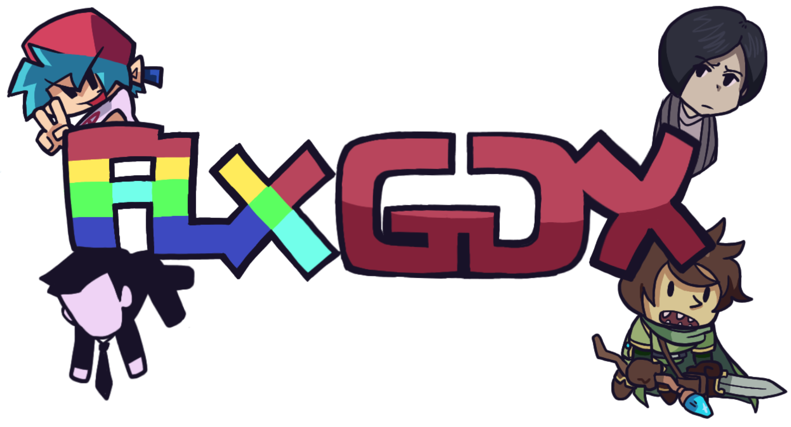

  
  
  # FlixelGDX
  
  **A powerful, beginner-friendly game development framework for Java**
  
  [📖 Docs](https://flixelgdx.org/docs) · [🚀 Getting Started](https://flixelgdx.org/getting-started) · [💬 Discussions](https://github.com/orgs/flixelgdx/discussions) · [🌐 Website](https://flixelgdx.org/)

# What is FlixelGDX?

FlixelGDX is an incredibly robust yet approachable game development framework for Java built on top of libGDX. Its ultimate goal is to provide the ability to create amazing games, all while being able to run it on almost any hardware. 

# Want to contribute?

FlixelGDX is 100% welcome and open for contributions. We welcome people of all backgrounds, regardless of experience. You can read more about how to contribute [here](https://github.com/flixelgdx/flixelgdx/blob/master/CONTRIBUTING.md).
